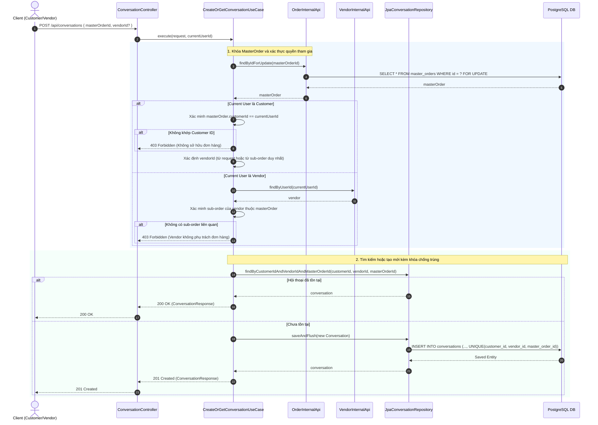
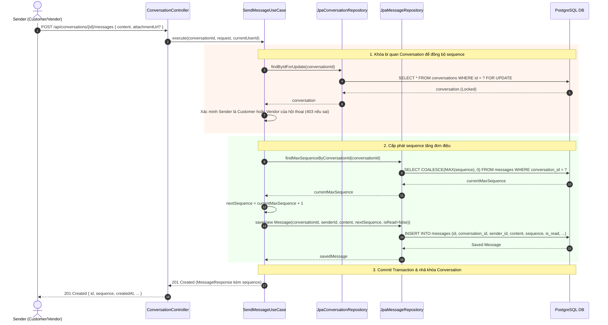
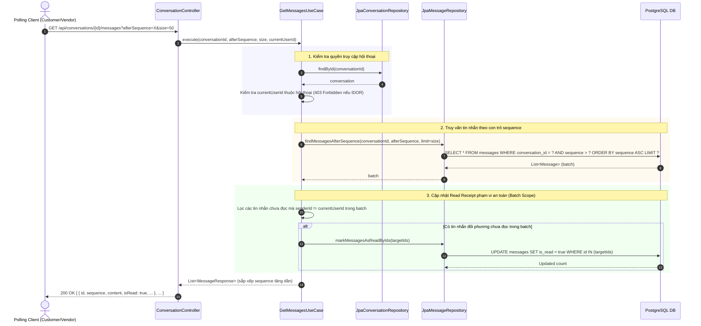

# 📖 TÓM TẮT CÁC SƠ ĐỒ — MODULE COMMUNICATION (TIN NHẮN TRAO ĐỔI CUSTOMER - VENDOR)

> Module Communication cung cấp hệ thống nhắn tin trực tiếp giữa Khách hàng (Customer) và Đối tác (Vendor) gắn liền với từng đơn hàng (`MasterOrder`), áp dụng cơ chế khóa bi quan (Pessimistic Locking) nhằm đảm bảo tính đơn điệu của chuỗi tin nhắn (Monotonic Sequencing), chống trùng lặp hội thoại đa luồng, hỗ trợ cơ chế REST polling tối ưu dựa trên con trỏ (`afterSequence`) và tự động cập nhật trạng thái đã đọc (Read Receipt) an toàn theo từng batch.

| # | Sơ đồ | Loại | Nội dung |
|---|-------|------|----------|
| 1 | `Communication_ConversationLifecycle` | Sequence Diagram | Khởi tạo hoặc truy xuất hội thoại: Khóa MasterOrder, kiểm tra phân quyền RBAC/IDOR, unique constraint chống trùng lặp hội thoại trong môi trường đồng thời cao. |
| 2 | `Communication_MessageSending_MonotonicSequencing` | Sequence Diagram | Gửi tin nhắn và cấp phát Sequence đơn điệu: Khóa bi quan bản ghi Conversation tới khi commit, tăng sequence tự động theo từng hội thoại, ngăn chặn race condition. |
| 3 | `Communication_CursorPolling_BatchReadReceipt` | Sequence Diagram | REST Polling qua Cursor và cập nhật Read Receipt: Polling theo `afterSequence`, trả về tin nhắn tăng dần theo sequence và chỉ đánh dấu đã đọc các tin nhắn đối phương nằm trong batch nhận được. |

---

## 1. Communication_ConversationLifecycle — Khởi Tạo & Truy Xuất Hội Thoại

**Lớp xử lý chính:** `com.danasea.backend.modules.communication.application.usecases.CreateOrGetConversationUseCase`

### Sơ đồ tuần tự (Sequence Diagram)

### Quy tắc nghiệp vụ & Cơ chế bảo vệ:
1. **Khóa MasterOrder:** Khi một bên yêu cầu tạo hoặc mở chat, hệ thống khóa dòng `master_orders` liên quan trong transaction để serialize các request tạo chat đồng thời.
2. **Unique Constraint (Ràng buộc toàn vẹn):** Cột `(customer_id, vendor_id, master_order_id)` được gán unique constraint trong cơ sở dữ liệu (`uk_conversations_cust_vend_order`). Nếu 2 luồng cùng vượt qua bước kiểm tra, DB sẽ chặn đứng luồng thứ hai mà không tạo bản ghi rác.
3. **Đơn hàng đa Vendor:** Trường hợp `MasterOrder` gồm nhiều đơn con của nhiều Vendor khác nhau, request bắt buộc phải chỉ định rõ `vendorId` muốn trao đổi. Nếu không chỉ định, hệ thống trả về `400 Bad Request`.

---

## 2. Communication_MessageSending_MonotonicSequencing — Gửi Tin Nhắn & Chuỗi Thứ Tự Đơn Điệu

**Lớp xử lý chính:** `com.danasea.backend.modules.communication.application.usecases.SendMessageUseCase`

### Sơ đồ tuần tự (Sequence Diagram)

### Đặc tính kỹ thuật:
- **Pessimistic Write Lock (`FOR UPDATE`):** Đảm bảo tại một thời điểm, chỉ một tin nhắn duy nhất được ghi vào một hội thoại cụ thể. Các tin nhắn gửi song song từ hai phía sẽ được xếp hàng tuần tự.
- **Monotonic Sequence (`sequence`):** Cấp phát số thứ tự tăng liên tục $1, 2, 3...$ không ngắt quãng và không trùng lặp cho từng cuộc hội thoại. Có ràng buộc `UNIQUE(conversation_id, sequence)` bảo vệ ở mức cơ sở dữ liệu.
- **Giới hạn nội dung:** Kiểm tra độ dài nội dung tin nhắn không rỗng và không vượt quá 5.000 ký tự.

---

## 3. Communication_CursorPolling_BatchReadReceipt — Polling & Đánh Dấu Đã Đọc Theo Batch

**Lớp xử lý chính:** `com.danasea.backend.modules.communication.application.usecases.GetMessagesUseCase`

### Sơ đồ tuần tự (Sequence Diagram)

### Hợp đồng Cursor Polling & Quy tắc Read Receipt:
1. **Khởi đầu polling:** Client truyền `afterSequence=0` ở request đầu tiên để nạp các tin nhắn ban đầu.
2. **Cập nhật Cursor:** Ở các request tiếp theo, client gửi `afterSequence = max(sequence)` của tin nhắn cuối cùng nhận được. Con trỏ chỉ được tăng sau khi client đã xử lý xong toàn bộ batch nhận về.
3. **Phạm vi Read Receipt (Batch Invariant):** 
   - Hệ thống **chỉ đánh dấu đã đọc các tin nhắn nằm trong batch được trả về**.
   - Không đánh dấu các tin nhắn chưa được nạp (nằm ngoài batch) hoặc các tin nhắn do chính người gọi gửi (`senderId == currentUserId`).
4. **Validation:** Nghiêm cấm truyền đồng thời cả 2 tham số `after` (timestamp) và `afterSequence` (trả về `400 Bad Request`). Giới hạn `size` tối đa là 100 tin nhắn/batch.

---

# 📖 TÓM TẮT CÁC SƠ ĐỒ — MODULE COMMUNICATION (HỆ THỐNG THÔNG BÁO)

> Phân hệ Communication chịu trách nhiệm quản lý trung tâm thông báo người dùng (In-App Notification Center), cơ chế theo dõi trạng thái đã đọc (Read Tracking & Unread Count), phản ứng thời gian thực với các sự kiện thanh toán / hoàn tiền qua kiến trúc Event-Driven, và tác vụ định kỳ quét nhắc chuyến đi sắp khởi hành (Trip Reminder Scheduled Job) tích hợp cơ chế Push Notification.

| # | Sơ đồ | Loại | Nội dung |
|---|-------|------|----------|
| 1 | `InApp_Notification_Lifecycle_And_ReadTracking_Flow` | Sequence Diagram | Quản lý thông báo người dùng (`/api/notifications`): Phân trang, đánh dấu đã đọc từng thông báo (chống IDOR), đánh dấu đọc tất cả (Idempotent Bulk Update) và đếm số lượng chưa đọc. |
| 2 | `Payment_And_Refund_Event_Notification_Flow` | Sequence Diagram | Kiến trúc Hướng Sự Kiện (Event-Driven): Lắng nghe `PaymentSuccessEvent` và `RefundCompletedEvent` để phát sinh thông báo tức thời cho Khách hàng và Đối tác. |
| 3 | `Scheduled_Trip_Reminder_Job_Flow` | Sequence Diagram | Tác vụ định kỳ nhắc chuyến (`TripReminderJob`): Quét các slot khởi hành trong vòng 24 giờ, chống gửi lặp qua khóa Idempotency, đồng bộ Mobile Push sau commit CSDL. |

---

## 1. InApp_Notification_Lifecycle_And_ReadTracking_Flow.mmd — Vòng Đời Thông Báo & Trạng Thái Đã Đọc

**Điểm truy cập API:**
- `GET /api/notifications`: Lấy danh sách thông báo của người dùng hiện tại (hỗ trợ phân trang `page`, `size`).
- `PATCH /api/notifications/{id}/read`: Đánh dấu một thông báo cụ thể là đã đọc.
- `PATCH /api/notifications/read-all`: Đánh dấu toàn bộ thông báo chưa đọc của người dùng là đã đọc.
- `GET /api/notifications/unread-count`: Đếm tổng số thông báo chưa đọc phục vụ hiển thị huy hiệu (Badge Counter).

**Quy tắc bảo mật & Toàn vẹn dữ liệu (R4):**
- **Xác thực danh tính:** Toàn bộ API yêu cầu người dùng đã đăng nhập (`@PreAuthorize("isAuthenticated()")`).
- **Phòng chống IDOR (Insecure Direct Object Reference):** Khi gọi `PATCH /api/notifications/{id}/read`, `MarkNotificationReadUseCase` kiểm tra nghiêm ngặt `notification.userId == currentUserId`. Nếu người dùng cố tình thao tác trên thông báo của người khác, hệ thống chặn đứng với mã lỗi `403 Forbidden` (`UnauthorizedNotificationAccessException`).
- **Phân tách trạng thái gửi và đọc:** Trạng thái `SENT` chỉ biểu thị thông báo đã được gửi thành công vào hộp thư. Trường `isRead` (`boolean`) và `readAt` (`OffsetDateTime`) thể hiện chính xác thời điểm người dùng thực sự đọc thông báo.
- **Tính Idempotent:** Gọi `PATCH /api/notifications/read-all` khi `unreadCount = 0` trả về `updatedCount = 0` một cách an toàn và không gây lỗi logic.

---

## 2. Payment_And_Refund_Event_Notification_Flow.mmd — Sự Kiện Thanh Toán & Hoàn Tiền Tức Thời

**Kiến trúc xử lý:** Phân tách hoàn toàn (Decoupled) thông qua Spring `ApplicationEventPublisher`. Các service lõi thanh toán không phụ thuộc trực tiếp vào module thông báo.

**Các luồng sự kiện (R5):**
1. **Sự kiện thanh toán thành công (`PaymentSuccessEvent`):**
   - Được bắn từ `OrderPaymentService` ngay sau khi cổng thanh toán xác nhận giao dịch thành công và `ConfirmBookingUseCase` đã hoàn tất.
   - `PaymentNotificationEventListener` tiếp nhận sự kiện:
     - Tạo thông báo In-App cho **Khách hàng**: Tiêu đề "Thanh toán thành công", nội dung chi tiết đơn hàng, liên kết tới `ORDER`.
     - Duyệt danh sách đơn con (`SubOrders`), trích xuất các `vendorId` duy nhất và gửi thông báo In-App cho từng **Đối tác**: "Có đơn đặt dịch vụ mới".
2. **Sự kiện hoàn tiền thành công (`RefundCompletedEvent`):**
   - Được bắn từ `RefundProcessingService` khi giao dịch bồi hoàn đạt trạng thái `PROCESSED`.
   - `RefundNotificationEventListener` tiếp nhận sự kiện và gửi thông báo In-App cho **Khách hàng** kèm số tiền hoàn đã được định dạng bản địa hóa.

---

## 3. Scheduled_Trip_Reminder_Job_Flow.mmd — Tác Vụ Quét Nhắc Chuyến Khởi Hành

**Thành phần thực thi:** `com.danasea.backend.modules.communication.infrastructure.jobs.TripReminderJob`

**Nguyên lý vận hành (R5):**
1. **Lịch biểu kích hoạt:** Chạy định kỳ mỗi giờ (`@Scheduled(cron = "0 0 * * * *", zone = "Asia/Ho_Chi_Minh")`).
2. **Cửa sổ thời gian khởi hành (Window Scan):**
   - `now = LocalDateTime.now(Asia/Ho_Chi_Minh)`
   - `horizon = now.plusHours(24)`
   - Quét toàn bộ các `service_slots` có thời gian xuất phát nằm trong đoạn `[now, horizon]`.
3. **Bộ lọc đơn hợp lệ:** Chỉ gửi nhắc nhở cho các `SubOrder` có trạng thái `CONFIRMED` và `MasterOrder` có trạng thái thanh toán `PAID`.
4. **Cơ chế chống gửi trùng lặp (Idempotency):**
   - Khóa duy nhất dạng: `trip:{slotId}:customer:{customerId}`.
   - CSDL sử dụng `UNIQUE CONSTRAINT (idempotency_key)` (từ migration `V27__notification_read_tracking_and_idempotency.sql`).
   - Nếu tác vụ chạy lại trong cùng một ngày, lệnh chèn bị bỏ qua (`DO NOTHING`) mà không tạo thêm thông báo dư thừa.
5. **Đồng bộ Mobile Push:**
   - Sử dụng `TransactionSynchronizationManager.registerSynchronization` với hook `afterCommit()`.
   - Đảm bảo chỉ khi giao dịch CSDL đã commit thành công 100%, lệnh gọi `PushNotificationPort.sendPush(...)` mới được kích hoạt, tránh gửi push giả khi có rollback CSDL.
