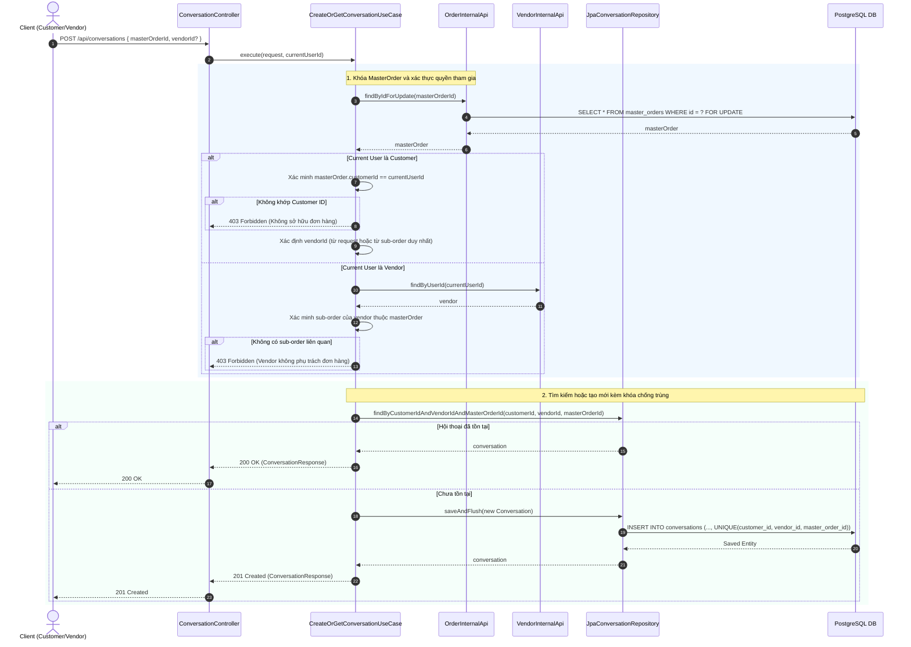
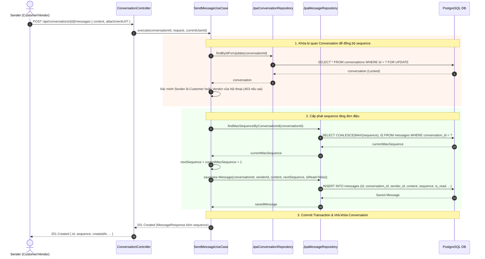
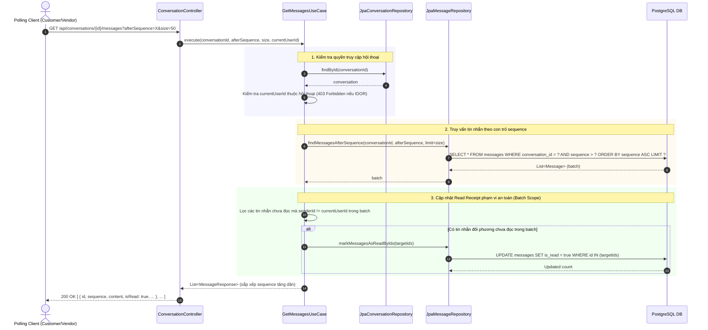

# 📖 TÓM TẮT CÁC SƠ ĐỒ — MODULE COMMUNICATION (TIN NHẮN TRAO ĐỔI CUSTOMER - VENDOR)

> Module Communication cung cấp hệ thống nhắn tin trực tiếp giữa Khách hàng (Customer) và Đối tác (Vendor) gắn liền với từng đơn hàng (`MasterOrder`), áp dụng cơ chế khóa bi quan (Pessimistic Locking) nhằm đảm bảo tính đơn điệu của chuỗi tin nhắn (Monotonic Sequencing), chống trùng lặp hội thoại đa luồng, hỗ trợ cơ chế REST polling tối ưu dựa trên con trỏ (`afterSequence`) và tự động cập nhật trạng thái đã đọc (Read Receipt) an toàn theo từng batch.

| # | Sơ đồ | Loại | Nội dung |
|---|-------|------|----------|
| 1 | `Communication_ConversationLifecycle` | Sequence Diagram | Khởi tạo hoặc truy xuất hội thoại: Khóa MasterOrder, kiểm tra phân quyền RBAC/IDOR, unique constraint chống trùng lặp hội thoại trong môi trường đồng thời cao. |
| 2 | `Communication_MessageSending_MonotonicSequencing` | Sequence Diagram | Gửi tin nhắn và cấp phát Sequence đơn điệu: Khóa bi quan bản ghi Conversation tới khi commit, tăng sequence tự động theo từng hội thoại, ngăn chặn race condition. |
| 3 | `Communication_CursorPolling_BatchReadReceipt` | Sequence Diagram | REST Polling qua Cursor và cập nhật Read Receipt: Polling theo `afterSequence`, trả về tin nhắn tăng dần theo sequence và chỉ đánh dấu đã đọc các tin nhắn đối phương nằm trong batch nhận được. |

---

## 1. Communication_ConversationLifecycle — Khởi Tạo & Truy Xuất Hội Thoại

**Lớp xử lý chính:** `com.danasea.backend.modules.communication.application.usecases.CreateOrGetConversationUseCase`

### Sơ đồ tuần tự (Sequence Diagram)

### Quy tắc nghiệp vụ & Cơ chế bảo vệ:
1. **Khóa MasterOrder:** Khi một bên yêu cầu tạo hoặc mở chat, hệ thống khóa dòng `master_orders` liên quan trong transaction để serialize các request tạo chat đồng thời.
2. **Unique Constraint (Ràng buộc toàn vẹn):** Cột `(customer_id, vendor_id, master_order_id)` được gán unique constraint trong cơ sở dữ liệu (`uk_conversations_cust_vend_order`). Nếu 2 luồng cùng vượt qua bước kiểm tra, DB sẽ chặn đứng luồng thứ hai mà không tạo bản ghi rác.
3. **Đơn hàng đa Vendor:** Trường hợp `MasterOrder` gồm nhiều đơn con của nhiều Vendor khác nhau, request bắt buộc phải chỉ định rõ `vendorId` muốn trao đổi. Nếu không chỉ định, hệ thống trả về `400 Bad Request`.

---

## 2. Communication_MessageSending_MonotonicSequencing — Gửi Tin Nhắn & Chuỗi Thứ Tự Đơn Điệu

**Lớp xử lý chính:** `com.danasea.backend.modules.communication.application.usecases.SendMessageUseCase`

### Sơ đồ tuần tự (Sequence Diagram)

### Đặc tính kỹ thuật:
- **Pessimistic Write Lock (`FOR UPDATE`):** Đảm bảo tại một thời điểm, chỉ một tin nhắn duy nhất được ghi vào một hội thoại cụ thể. Các tin nhắn gửi song song từ hai phía sẽ được xếp hàng tuần tự.
- **Monotonic Sequence (`sequence`):** Cấp phát số thứ tự tăng liên tục $1, 2, 3...$ không ngắt quãng và không trùng lặp cho từng cuộc hội thoại. Có ràng buộc `UNIQUE(conversation_id, sequence)` bảo vệ ở mức cơ sở dữ liệu.
- **Giới hạn nội dung:** Kiểm tra độ dài nội dung tin nhắn không rỗng và không vượt quá 5.000 ký tự.

---

## 3. Communication_CursorPolling_BatchReadReceipt — Polling & Đánh Dấu Đã Đọc Theo Batch

**Lớp xử lý chính:** `com.danasea.backend.modules.communication.application.usecases.GetMessagesUseCase`

### Sơ đồ tuần tự (Sequence Diagram)

### Hợp đồng Cursor Polling & Quy tắc Read Receipt:
1. **Khởi đầu polling:** Client truyền `afterSequence=0` ở request đầu tiên để nạp các tin nhắn ban đầu.
2. **Cập nhật Cursor:** Ở các request tiếp theo, client gửi `afterSequence = max(sequence)` của tin nhắn cuối cùng nhận được. Con trỏ chỉ được tăng sau khi client đã xử lý xong toàn bộ batch nhận về.
3. **Phạm vi Read Receipt (Batch Invariant):** 
   - Hệ thống **chỉ đánh dấu đã đọc các tin nhắn nằm trong batch được trả về**.
   - Không đánh dấu các tin nhắn chưa được nạp (nằm ngoài batch) hoặc các tin nhắn do chính người gọi gửi (`senderId == currentUserId`).
4. **Validation:** Nghiêm cấm truyền đồng thời cả 2 tham số `after` (timestamp) và `afterSequence` (trả về `400 Bad Request`). Giới hạn `size` tối đa là 100 tin nhắn/batch.
