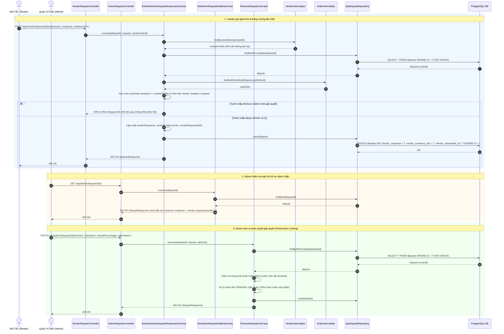
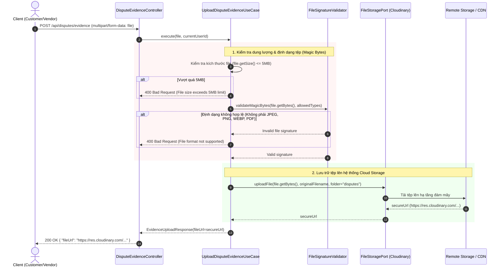

# 📖 TÓM TẮT CÁC SƠ ĐỒ — MODULE DISPUTE (KHIẾU NẠI ĐƠN HÀNG)

> Module Dispute quản lý toàn bộ quy trình tiếp nhận khiếu nại từ khách hàng sau khi trải nghiệm dịch vụ và hỗ trợ quản trị viên (Admin) thẩm định, đưa ra quyết định xử lý hoàn tiền hoặc bác bỏ khiếu nại.

| # | Sơ đồ | Loại | Nội dung |
|---|-------|------|----------|
| 1 | `Dispute_CustomerCreate` | Sequence Diagram | Khách hàng khởi tạo khiếu nại: Kiểm tra IDOR, xác thực đơn thuộc sở hữu, kiểm tra trạng thái hợp lệ (`CONFIRMED`/`COMPLETED`), giới hạn 7 ngày sau trải nghiệm và ngăn ngừa tạo khiếu nại trùng lặp |
| 2 | `Dispute_AdminResolve` | Sequence Diagram | Admin thẩm định và giải quyết khiếu nại: Áp dụng Pessimistic Write Lock, phân nhánh tài chính (hoàn toàn phần, hoàn một phần hoặc bác bỏ), tự động tạo bản ghi Refund bất biến kèm Idempotency Key |
| 3 | `Dispute_StateMachine` | State Machine | Sơ đồ chuyển đổi trạng thái khiếu nại từ `OPEN` qua `UNDER_REVIEW` đến các trạng thái kết thúc (`RESOLVED_REFUND`, `RESOLVED_PARTIAL`, `RESOLVED_REJECTED`) |
| 4 | `Dispute_VendorResponse_And_AdminResolve` | Sequence Diagram | Đối tác gửi giải trình & bằng chứng đối chất, Admin tra cứu hồ sơ toàn diện: Khóa bi quan chống ghi đè phán quyết, kiểm soát Vendor Isolation chặt chẽ |
| 5 | `Dispute_ControlledEvidenceUpload` | Sequence Diagram | Tải lên bằng chứng an toàn: Kiểm tra magic bytes thực tế, giới hạn định dạng (JPEG, PNG, WEBP, PDF) và dung lượng <= 5MB qua FileStoragePort |

---

## 1. Dispute_CustomerCreate.png — Khách Hàng Mở Khiếu Nại

**Lớp xử lý chính:** `com.danasea.backend.modules.dispute.application.usecases.CreateDisputeUseCase`

**Luồng nghiệp vụ chi tiết:**
1. Khách hàng gửi yêu cầu mở khiếu nại qua API `POST /api/orders/{orderId}/disputes` với thông tin `{subOrderId, reason, description, evidenceUrls}`.
2. Hệ thống kiểm tra sự tồn tại của đơn hàng `MasterOrder` (ném lỗi `404` nếu không tìm thấy).
3. **IDOR Check:** Xác minh người gửi yêu cầu chính là chủ sở hữu đơn hàng (`masterOrder.customerId == customerId`). Nếu không phải, chặn với `403 UnauthorizedDisputeAccessException`.
4. Xác minh đơn phụ `SubOrder` thuộc về `MasterOrder` được chỉ định.
5. **Ràng buộc trạng thái:** Chỉ cho phép khiếu nại các đơn đã hoàn thành hoặc đã được xác nhận (`COMPLETED` hoặc `CONFIRMED`). Nếu đơn đang ở trạng thái khác, trả về `400 InvalidSubOrderStateException`.
6. **Thời hạn khiếu nại:** Kiểm tra thời điểm khiếu nại không vượt quá **7 ngày** tính từ ngày trải nghiệm thực tế (`slot.date`). Nếu quá hạn, trả về `400 DisputePeriodExpiredException`.
7. **Chống trùng lặp (Anti-duplicate):** Kiểm tra xem đơn phụ này đã có khiếu nại nào đang ở trạng thái `OPEN` hoặc `UNDER_REVIEW` hay chưa. Nếu đã có, trả về `409 DuplicateDisputeException`.
8. Khởi tạo và lưu bản ghi khiếu nại mới với trạng thái ban đầu là `OPEN`.

---

## 2. Dispute_AdminResolve.png — Admin Giải Quyết Khiếu Nại

**Lớp xử lý chính:** `com.danasea.backend.modules.dispute.application.usecases.ResolveDisputeUseCase`

**Luồng nghiệp vụ chi tiết:**
1. Admin gửi quyết định qua `PATCH /api/admin/disputes/{disputeId}/resolve` kèm `{resolution, refundPercentage, adminNote}`.
2. Áp dụng **Pessimistic Lock** (`findByIdForUpdate`) để đảm bảo tính an toàn đồng thời trong cơ sở dữ liệu.
3. Kiểm tra nếu khiếu nại đã được giải quyết trước đó, ném ngoại lệ `409 DisputeAlreadyResolvedException`.
4. **Phân nhánh xử lý tài chính theo quyết định:**
   - **`RESOLVED_REFUND` (Hoàn 100%):** Tính số tiền hoàn = toàn bộ giá trị đơn phụ (`subtotal`). Ủy quyền qua `financialRefundPort.initiateRefund(...)` tạo bản ghi `Refund (PENDING)` với lý do `DISPUTE` và kích hoạt luồng hoàn tiền thực tế qua cổng thanh toán gốc.
   - **`RESOLVED_PARTIAL` (Hoàn một phần):** Tính số tiền hoàn theo tỷ lệ phần trăm được chỉ định (`subtotal * percentage / 100`). Ủy quyền qua `financialRefundPort.initiateRefund(...)` tạo bản ghi `Refund (PENDING)` chuyển sang `RefundProcessingService`.
   - **`RESOLVED_REJECTED` (Bác bỏ):** Giữ nguyên đơn hàng, không tạo bản ghi hoàn tiền.
5. Tạo khóa chống lặp hoàn tiền (**Idempotency Key:** `"dispute-{disputeId}"`) để đảm bảo không bị trừ tiền nhiều lần.
6. Cập nhật trạng thái Dispute thành trạng thái giải quyết tương ứng, ghi nhận `adminId` và thời điểm phê duyệt.

---

## 3. Dispute_StateMachine.png — Vòng Đời Trạng Thái Khiếu Nại

- `OPEN`: Trạng thái ban đầu sau khi khách hàng tạo khiếu nại thành công.
- `UNDER_REVIEW`: Trạng thái khi Admin hoặc bộ phận CSKH tiếp nhận hồ sơ xem xét.
- `RESOLVED_REFUND`: Admin chấp thuận khiếu nại và đồng ý hoàn tiền 100%. Tự động sinh `Refund` sang cổng thanh toán.
- `RESOLVED_PARTIAL`: Admin chấp thuận bồi thường một phần giá trị đơn. Tự động sinh `Refund` theo tỷ lệ đã thỏa thuận.
- `RESOLVED_REJECTED`: Admin từ chối khiếu nại do không đủ bằng chứng hoặc không vi phạm điều khoản dịch vụ.

> 💡 **Tích hợp liên module:** Trong module **Settlement**, bất kỳ đơn hàng nào đang có Dispute ở trạng thái `OPEN` hoặc `UNDER_REVIEW` sẽ bị **loại trừ tự động (EXCLUDED)** khỏi bảng quyết toán của Vendor để phòng tránh thất thoát tài chính.

---

## 4. Dispute_VendorResponse_And_AdminResolve — Đối Tác Phản Hồi & Admin Thẩm Định Hồ Sơ

**Lớp xử lý chính:**
- `com.danasea.backend.modules.dispute.application.usecases.SubmitVendorDisputeResponseUseCase`
- `com.danasea.backend.modules.dispute.application.usecases.GetAdminDisputeDetailUseCase`
- `com.danasea.backend.modules.dispute.application.usecases.ResolveDisputeUseCase`

### Sơ đồ tuần tự (Sequence Diagram)

---

## 5. Dispute_ControlledEvidenceUpload — Tải Lên Bằng Chứng An Toàn

**Lớp xử lý chính:** `com.danasea.backend.modules.dispute.presentation.controllers.DisputeEvidenceController` & `UploadDisputeEvidenceUseCase`

### Sơ đồ tuần tự (Sequence Diagram)

### Đặc tính an toàn:
- **Magic Bytes Validation:** Không phụ thuộc vào phần mở rộng file (extension) của client gửi lên mà đọc trực tiếp các byte đầu tiên (file signature) để ngăn chặn việc tải lên file độc hại giả mạo (executable, script).
- **Hạn mức dung lượng:** Cố định tối đa 5MB mỗi tệp tải lên.
- **Tích hợp phi lưu trữ:** Tách biệt việc lưu trữ vật lý qua interface `FileStoragePort`, dễ dàng chuyển đổi linh hoạt giữa Cloudinary và S3/MinIO mà không ảnh hưởng tới code nghiệp vụ.

