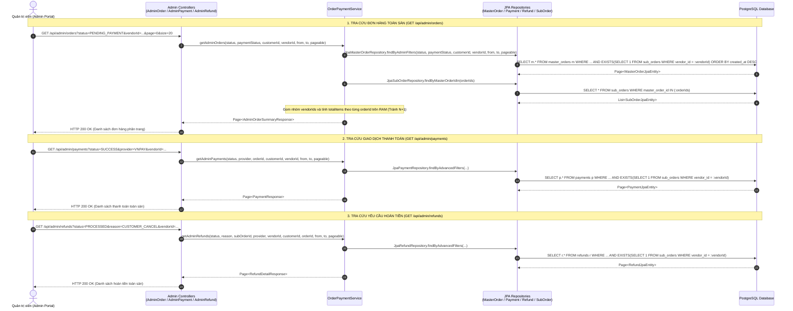
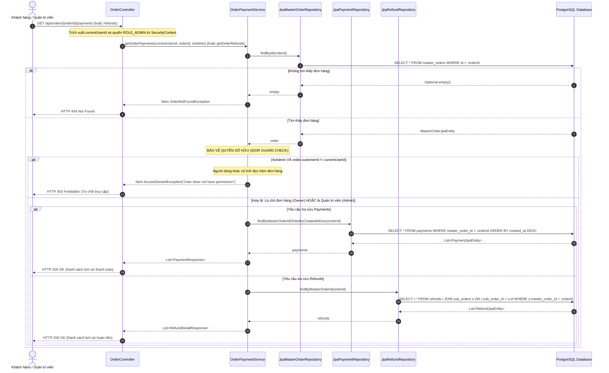
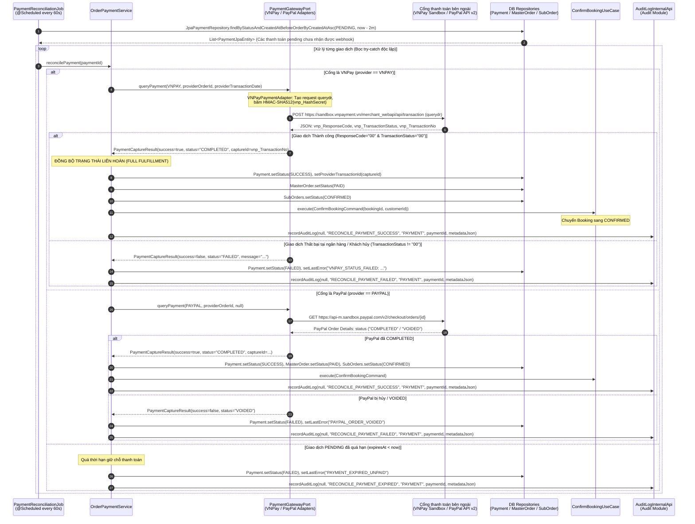
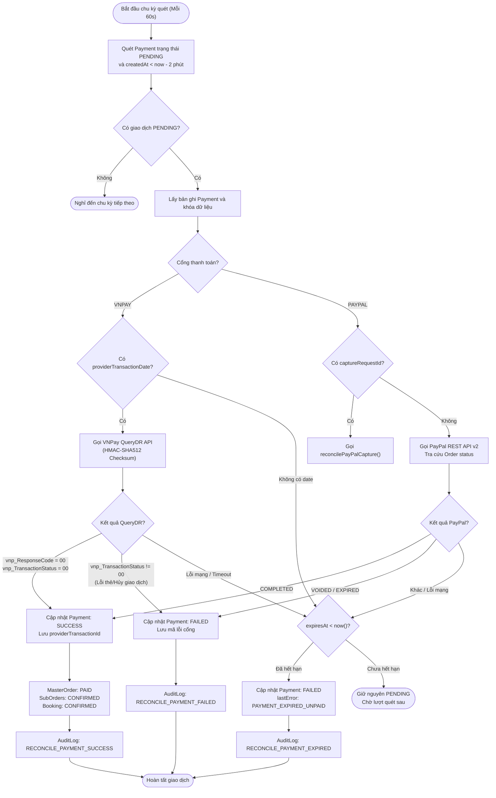

# 📖 LUỒNG NGHIỆP VỤ & SƠ ĐỒ — QUẢN TRỊ GIAO DỊCH, THEO DÕI HOÀN TIỀN & ĐỐI SOÁT TỰ ĐỘNG
*(Admin Transaction, Refund Tracking & Payment Reconciliation Workflows)*

> **Module:** Order & Payment / Refund / Audit  
> **Nhánh phát triển:** `admin_transaction_refund_management` (P1 Requirement)  
> **Phạm vi nghiệp vụ:** Cung cấp bộ API quản trị giao dịch toàn sàn cho Quản trị viên (Admin), API lịch sử thanh toán/hoàn tiền theo đơn hàng có kiểm soát bảo mật (IDOR Guard), cơ chế tra cứu trạng thái cổng tự động (VNPay QueryDR API & PayPal Capture Query) khi webhook bị chậm hoặc thất lạc, và tự động ghi nhận nhật ký kiểm toán hệ thống (Audit Log).

---

## 📑 MỤC LỤC SƠ ĐỒ

| # | Tên sơ đồ | Loại sơ đồ | Nội dung nghiệp vụ |
|---|-----------|-----------|--------------------|
| 1 | `Admin_MultiFilter_Listing_Flow` | Sequence Diagram | Admin tra cứu và lọc đa chiều Đơn hàng, Giao dịch thanh toán và Yêu cầu hoàn tiền toàn sàn (Tối ưu hóa tránh N+1 Query, hỗ trợ lọc `vendorId` qua `EXISTS sub_orders`). |
| 2 | `Order_History_IDOR_Guard_Flow` | Sequence Diagram | Khách hàng và Admin tra cứu lịch sử thanh toán (`/payments`) và hoàn tiền (`/refunds`) của đơn hàng với cơ chế phòng vệ IDOR nghiêm ngặt (chặn 403 Forbidden nếu không phải chủ đơn). |
| 3 | `Automated_Payment_Reconciliation_Flow` | Sequence Diagram | Scheduled Background Job (`PaymentReconciliationJob`): Tự động quét giao dịch `PENDING` > 2 phút, gọi VNPay QueryDR (HMAC-SHA512) và PayPal Capture để đồng bộ trạng thái `PAID` và ghi nhận `AuditLogInternalApi`. |
| 4 | `Reconciliation_Decision_StateMachine` | State Machine / Flowchart | Cây quyết định đối soát dòng tiền đa cổng, xử lý timeout, quá hạn thanh toán (`PAYMENT_EXPIRED_UNPAID`) và chuyển đổi trạng thái liên hoàn sang `MasterOrder`, `SubOrder` và `Booking`. |

---

## 1. SƠ ĐỒ 1: QUẢN TRỊ TOÀN SÀN ĐƠN HÀNG, THANH TOÁN & HOÀN TIỀN (ADMIN LISTING)

### Mô tả nghiệp vụ
Quản trị viên cần công cụ giám sát toàn diện mọi giao dịch phát sinh trên sàn DANASEA:
- **`GET /api/admin/orders`**: Danh sách đơn hàng toàn sàn. Nhận các bộ lọc `status`, `paymentStatus`, `customerId`, `vendorId` (lọc theo đơn vị cung ứng qua bảng phụ `sub_orders`), khoảng thời gian `from`/`to` (hoặc `fromDate`/`toDate`). Trả về DTO tóm tắt tối ưu `AdminOrderSummaryResponse` (chứa `totalItems`, `vendorIds`, `totalAmount`).
- **`GET /api/admin/payments` & `GET /api/admin/payments/{id}`**: Giám sát dòng tiền thanh toán toàn sàn, lọc theo cổng thanh toán (`provider`), mã đơn (`orderId`), `vendorId`, `customerId`, thời gian.
- **`GET /api/admin/refunds` & `GET /api/admin/refunds/{id}`**: Giám sát các yêu cầu hoàn tiền, lọc theo lý do (`reason`), trạng thái (`status`), `subOrderId`, `orderId`, `vendorId`, `customerId`.

### Thiết kế tối ưu hóa CSDL (Anti-N+1 Query & Sub-query EXISTS)
- Với `vendorId` trong đơn hàng: Sử dụng mệnh đề `EXISTS (SELECT 1 FROM sub_orders so WHERE so.master_order_id = m.id AND so.vendor_id = :vendorId)`.
- Gom nhóm `SubOrder` theo lô (`findByMasterOrderIdIn(orderIds)`) trên bộ nhớ để đếm số items và trích xuất danh sách `vendorIds` mà không phát sinh truy vấn N+1 vào database.

---

## 2. SƠ ĐỒ 2: LỊCH SỬ GIAO DỊCH & HOÀN TIỀN THEO ĐƠN HÀNG (IDOR GUARD FLOW)

### Mô tả nghiệp vụ
Khách hàng có nhu cầu xem lại toàn bộ lịch sử thanh toán và tiến trình hoàn tiền của đơn hàng mình đã mua:
- **`GET /api/orders/{id}/payments`**: Trả về các lần tạo intent, mã tham chiếu cổng, số tiền và trạng thái thanh toán.
- **`GET /api/orders/{id}/refunds`**: Trả về danh sách chi tiết các yêu cầu bồi hoàn/hủy chỗ gắn với từng dịch vụ con (`sub_orders`).
- **Cơ chế an ninh IDOR (Insecure Direct Object Reference):**
  - Hệ thống lấy `currentUserId` từ Spring SecurityContext.
  - So sánh đối chiếu `assertOwner(order.getCustomerId(), currentUserId)`.
  - Nếu là tài khoản khác (User B) cố tình truy cập đơn của User A: Lập tức chặn với ngoại lệ `AccessDeniedException` (**HTTP 403 Forbidden**).
  - Quản trị viên (`ROLE_ADMIN`) có quyền xem lịch sử của mọi đơn hàng phục vụ hỗ trợ giải quyết sự cố.

---

## 3. SƠ ĐỒ 3: TỰ ĐỘNG ĐỐI SOÁT CỔNG THANH TOÁN (PAYMENT RECONCILIATION JOB)

### Mô tả nghiệp vụ
Trong các kịch bản mạng thực tế, Webhook IPN từ cổng thanh toán có thể bị thất lạc, drop mạng, hoặc đến chậm sau nhiều phút. Nếu không có cơ chế đối soát:
- Khách hàng đã bị trừ tiền ở ngân hàng/cổng nhưng đơn hàng trên hệ thống DANASEA vẫn ở trạng thái `PENDING_PAYMENT`.
- Chỗ giữ (Booking HOLD) có thể bị hết hạn oan uổng.

**Giải pháp:** Scheduled Job ngầm `PaymentReconciliationJob` chạy mỗi 60 giây:
1. **Quét giao dịch quá hạn:** Quét các payment `PENDING` tạo trước mốc 2 phút (`createdAt < now - 2m`).
2. **Chủ động tra soát cổng (QueryDR):**
   - **VNPay:** Gọi VNPay QueryDR API với `vnp_Command=querydr`, tạo chữ ký checksum HMAC-SHA512 đối chiếu mã đơn hàng và ngày giao dịch `providerTransactionDate`.
   - **PayPal:** Tra cứu trạng thái Order/Capture v2 từ cổng PayPal.
3. **Đồng bộ liên hoàn nguyên tử:**
   - Nếu cổng báo `COMPLETED`: Cập nhật `Payment` -> `SUCCESS`, `MasterOrder` -> `PAID`, `SubOrder` -> `CONFIRMED`, hoàn tất `Booking` -> `CONFIRMED`.
   - Nếu cổng báo `FAILED`: Cập nhật `Payment` -> `FAILED` kèm lý do lỗi.
   - Nếu quá hạn thanh toán (`expiresAt < now`): Cập nhật `Payment` -> `FAILED` (`PAYMENT_EXPIRED_UNPAID`).
4. **Lưu vết kiểm toán hệ thống:** Gọi `AuditLogInternalApi` ghi nhận chi tiết hành động đối soát (`RECONCILE_PAYMENT_SUCCESS`, `RECONCILE_PAYMENT_FAILED`, `RECONCILE_PAYMENT_EXPIRED`).

---

## 4. SƠ ĐỒ 4: CÂY QUYẾT ĐỊNH & MÁY TRẠNG THÁI ĐỐI SOÁT (RECONCILIATION STATE MACHINE)

Sơ đồ thể hiện quy trình phân nhánh quyết định logic đối soát dòng tiền khi hệ thống phát hiện giao dịch `PENDING` quá hạn:

---

## 5. TỔNG KẾT CÁC LỚP THÀNH PHẦN MÃ NGUỒN LIÊN QUAN

| Thành phần | Đường dẫn tệp tin | Trách nhiệm chính |
| :--- | :--- | :--- |
| **Admin Order Controller** | `backend/.../modules/order/presentation/controllers/AdminOrderController.java` | Tiếp nhận `GET /api/admin/orders`, xử lý phân trang và truyền bộ lọc xuống service. |
| **Admin Payment Controller** | `backend/.../modules/order/presentation/controllers/AdminPaymentController.java` | Tiếp nhận `GET /api/admin/payments` và `GET /api/admin/payments/{id}`. |
| **Admin Refund Controller** | `backend/.../modules/order/presentation/controllers/AdminRefundController.java` | Tiếp nhận `GET /api/admin/refunds` và `GET /api/admin/refunds/{id}`. |
| **Order Controller** | `backend/.../modules/order/presentation/controllers/OrderController.java` | Tiếp nhận `GET /api/orders/{id}/payments` và `GET /api/orders/{id}/refunds` kèm IDOR Guard. |
| **Order Payment Service** | `backend/.../modules/order/application/OrderPaymentService.java` | Điều phối nghiệp vụ lọc đa bảng, gom nhóm tránh N+1, thực thi `reconcilePayment` và ghi Audit Log. |
| **Reconciliation Job** | `backend/.../modules/order/infrastructure/jobs/PaymentReconciliationJob.java` | Scheduled Job chạy định kỳ mỗi 60 giây quét các giao dịch pending treo. |
| **Payment Gateway Port** | `backend/.../modules/order/domain/ports/PaymentGatewayPort.java` | Định nghĩa giao diện `queryPayment(provider, providerOrderId, transactionDate)`. |
| **VNPay Adapter** | `backend/.../modules/order/infrastructure/adapters/VNPayPaymentAdapter.java` | Hiện thực gọi VNPay QueryDR API với băm HMAC-SHA512 checksum. |
| **PayPal Adapter** | `backend/.../modules/order/infrastructure/adapters/PayPalPaymentAdapter.java` | Hiện thực gọi PayPal Order/Capture Query qua REST API v2. |
| **Audit Internal API** | `backend/.../modules/audit/application/api/AuditLogInternalApi.java` | Lưu vết kiểm toán cho các sự kiện đối soát dòng tiền tự động. |
| **Database Migration V23** | `backend/.../resources/db/migration/V23__admin_transaction_reconciliation.sql` | Bổ sung index và cột `provider_order_id`, `provider_transaction_date` tối ưu tốc độ tra cứu. |
