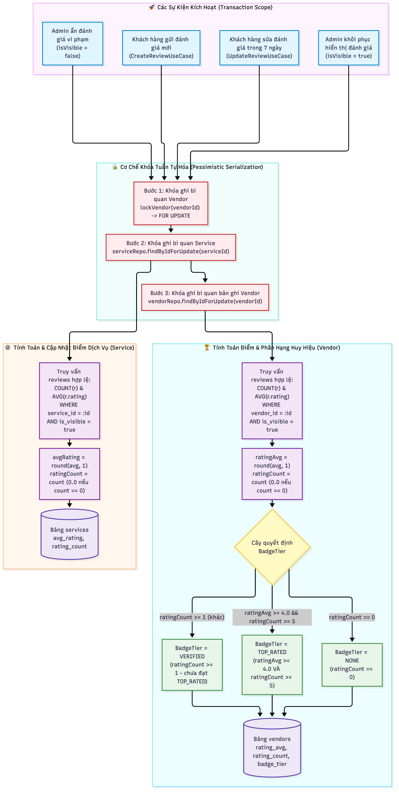

# 📖 TÓM TẮT CÁC SƠ ĐỒ — MODULE REVIEW (HỆ THỐNG ĐÁNH GIÁ & CHẤT LƯỢNG DỊCH VỤ)

> Module Review quản lý toàn bộ vòng đời ghi và đọc đánh giá của khách hàng sau khi hoàn thành trải nghiệm, hỗ trợ phản hồi chính thức từ đối tác cung cấp dịch vụ (Vendor), công cụ kiểm duyệt nội dung của quản trị viên (Admin), tự động tổng hợp điểm đánh giá (`avgRating`, `ratingCount`) và suy luận huy hiệu uy tín (`BadgeTier`) cho Vendor theo thời gian thực với cơ chế kiểm soát đồng thời (Concurrency Control & Pessimistic Locks) đạt độ tin cậy tuyệt đối.

| # | Sơ đồ | Loại | Nội dung |
|---|-------|------|----------|
| 1 | `Review_CustomerLifecycle` | Sequence Diagram | Vòng đời khách hàng: Kiểm tra quyền sở hữu đơn hàng (IDOR Guard), ràng buộc trạng thái `COMPLETED`, khóa bi quan Vendor (`lockVendor`), bảo vệ 2 tầng chống trùng lặp (App Level + DB Unique Constraint `uq_reviews_sub_order`), chính sách sửa đánh giá trong 7 ngày với scalar lookup, và báo cáo vi phạm (`Flag`) bảo mật thông tin |
| 2 | `Review_Moderation_And_VendorReply` | Sequence Diagram | Vận hành và kiểm duyệt: Khách vãng lai xem công khai (`toPublicResponse` triệt tiêu metadata riêng tư), Vendor xem và gửi phản hồi (khóa bản ghi `findByIdForUpdate` chống ghi đè), Admin kiểm duyệt ẩn/hiện với trường ghi chú riêng biệt `moderationNote` tách rời `flagReason` của người dùng |
| 3 | `Review_RatingCalculation_And_BadgeDerivation` | Flowchart | Động cơ tổng hợp điểm và suy luận huy hiệu: Cơ chế khóa tuần tự hóa 3 bước (`lockVendor` -> Khóa Service `FOR UPDATE` -> Khóa Vendor `FOR UPDATE`); chỉ tổng hợp trên các đánh giá hiển thị (`isVisible = true`); tự động cập nhật `avgRating`/`ratingCount` cho Service và Vendor; phân hạng huy hiệu `NONE`, `VERIFIED`, `TOP_RATED` |

---

## 1. Review_CustomerLifecycle_SD.png — Vòng Đời Đánh Giá Của Khách Hàng

**Các lớp xử lý chính:**
- Controllers: `CustomerReviewController`
- Use Cases: `CreateReviewUseCase`, `UpdateReviewUseCase`, `FlagReviewUseCase`
- Domain Models & Entities: `Review`, `ReviewJpaEntity`, `SubOrderJpaEntity`, `MasterOrderJpaEntity`
- Repositories: `JpaReviewRepository`, `JpaSubOrderRepository`, `JpaMasterOrderRepository`
- Domain Services: `ReviewRatingService`
- Database Migration: `V21__review_enhancements.sql`

**Luồng nghiệp vụ chi tiết:**

### Giai đoạn 1: Tạo mới đánh giá (`POST /api/sub-orders/{id}/reviews`)
1. **Tiếp nhận & Kiểm tra định dạng đầu vào (i18n Validation):**
   - Điểm số `rating`: Bắt buộc từ 1 đến 5 sao (`@Min(1)`, `@Max(5)` kèm ràng buộc DB `chk_reviews_rating`).
   - Bình luận `comment`: Tối đa 2.000 ký tự.
   - Hình ảnh `images`: Tối đa 5 URLs, mỗi URL tối đa 2.048 ký tự, bắt buộc đúng định dạng URL (`^https?://[^\s]+$`), lưu trữ dưới dạng JSON mảng trong cột kiểu dữ liệu `TEXT`.
2. **Bảo vệ quyền sở hữu (IDOR Guard):**
   - Tra cứu `SubOrder` theo `subOrderId` và đối chiếu `MasterOrder`.
   - Kiểm tra `masterOrder.customerId == currentUserId`. Nếu không khớp, ném ngoại lệ `UnauthorizedReviewAccessException` trả về **HTTP 403 Forbidden**.
3. **Kiểm tra trạng thái trải nghiệm:**
   - Đơn phụ bắt buộc phải ở trạng thái `COMPLETED` (`subOrder.status == COMPLETED`). Nếu chưa hoàn thành (đang `PENDING`, `CONFIRMED`, `CANCELLED`...), ném ngoại lệ `InvalidReviewSubOrderStateException` trả về **HTTP 400 Bad Request**.
4. **Khóa ghi bi quan Vendor (Pessimistic Lock Serialization):**
   - Gọi `reviewRatingService.lockVendor(subOrder.getVendorId())` thực hiện `SELECT ... FROM vendors WHERE id = :vendorId FOR UPDATE`.
   - Đảm bảo tất cả các luồng tạo đánh giá hoặc sửa điểm cho cùng một Vendor phải xếp hàng tuần tự, loại trừ hoàn toàn Race Condition làm sai lệch điểm tổng hợp.
5. **Cơ chế phòng vệ 2 tầng chống tạo trùng lặp (Anti-Duplicate Guards):**
   - **Tầng ứng dụng (App Level):** `reviewRepository.existsBySubOrderId(subOrderId)`. Nếu phát hiện đã có đánh giá, ném `DuplicateReviewException` (HTTP 409 Conflict).
   - **Tầng cơ sở dữ liệu (DB Level):** Áp dụng ràng buộc duy nhất `uq_reviews_sub_order` trên cột `sub_order_id`. Khi xảy ra cạnh tranh đồng thời vượt qua tầng ứng dụng, lệnh `saveAndFlush()` sẽ ném `DataIntegrityViolationException`, use case tự động bóc tách `ConstraintViolationException` và chuyển đổi thành `DuplicateReviewException` (HTTP 409 Conflict).
6. **Lưu trữ & Đồng bộ điểm số:**
   - Khởi tạo `ReviewJpaEntity` với `isVisible = true`, `isFlagged = false`.
   - Gọi `reviewRatingService.recalculateRatings(serviceId, vendorId)` cập nhật điểm dịch vụ và vendor ngay trong transaction.
7. Trả về thông tin đánh giá vừa tạo (`201 Created`).

### Giai đoạn 2: Chỉnh sửa đánh giá (`PUT /api/reviews/{id}` hoặc alias `PUT /api/sub-orders/{id}/reviews`)
1. **Xử lý Alias SubOrder an toàn:**
   - Khi gọi qua đường dẫn alias `/api/sub-orders/{id}/reviews`, hệ thống thực hiện truy vấn scalar `reviewRepository.findReviewIdBySubOrderId(subOrderId)` để lấy trực tiếp `reviewId` dạng UUID, tránh nạp snapshot thực thể cũ trước khi khóa.
2. **Khóa bi quan bản ghi Review:**
   - Thực thi `reviewRepository.findByIdForUpdate(reviewId)` (`SELECT ... FROM reviews WHERE id = :id FOR UPDATE`).
   - Ngăn chặn triệt để xung đột khi Khách hàng sửa, Vendor phản hồi và Admin ẩn đánh giá diễn ra đồng thời.
3. **Kiểm tra quyền sở hữu & Thời hạn 7 ngày:**
   - Kiểm tra `review.customerId == currentUserId` (403 Forbidden nếu không phải tác giả).
   - Kiểm tra `OffsetDateTime.now() <= review.createdAt.plusDays(7)`. Nếu quá 7 ngày, ném `ReviewPeriodExpiredException` (HTTP 400 Bad Request).
4. **Cập nhật & Đồng bộ điểm:**
   - Cập nhật số sao, bình luận, danh sách ảnh mới và lưu DB.
   - Kích hoạt `reviewRatingService.recalculateRatings(...)` tính lại điểm Service và Vendor.
5. Trả về thông tin đánh giá đã cập nhật (`200 OK`).

### Giai đoạn 3: Báo cáo đánh giá vi phạm (`POST /api/reviews/{id}/flag`)
1. Người dùng gửi lý do báo cáo `{reason}` (tối đa 255 ký tự).
2. Hệ thống áp dụng khóa bi quan `findByIdForUpdate(reviewId)`.
3. **Bảo vệ tính riêng tư (Privacy Guard):**
   - Nếu đánh giá đã bị Admin ẩn (`review.isVisible == false`), ném ngay `ReviewNotFoundException` (HTTP 404 Not Found), ngăn chặn người dùng dò quét hoặc đọc trộm thông tin của các đánh giá đã bị ẩn.
4. Đánh dấu `review.isFlagged = true`, lưu lại `review.flagReason = reason`.
5. **Che giấu metadata:** Trả về `FlagReviewResponse(id, isFlagged = true)` chỉ gồm ID và cờ xác nhận, hoàn toàn không trả về nội dung đánh giá để bảo vệ dữ liệu.

---

## 2. Review_Moderation_And_VendorReply_SD.png — Vận Hành, Phản Hồi Đối Tác & Kiểm Duyệt Quản Trị

**Các lớp xử lý chính:**
- Controllers: `ServiceReviewController`, `VendorReviewController`, `AdminReviewController`
- Use Cases: `GetServiceReviewsUseCase`, `GetVendorReviewsUseCase`, `ReplyVendorReviewUseCase`, `GetAdminReviewsUseCase`, `UpdateReviewVisibilityUseCase`
- Mappers: `ReviewMapper` (phân tách rõ ràng giữa `toResponse` và `toPublicResponse`)
- Repositories: `JpaReviewRepository`, `JpaVendorRepository`

**Luồng nghiệp vụ chi tiết:**

### Phân hệ 1: Xem đánh giá công khai (`GET /api/services/{id}/reviews`)
1. Khách vãng lai truy cập xem đánh giá của một tour/dịch vụ (endpoint `permitAll()`).
2. Truy vấn phân trang chỉ các đánh giá hợp lệ: `findByServiceIdAndIsVisibleTrue(serviceId, pageable)`.
3. **Triệt tiêu hoàn toàn metadata nội bộ (`toPublicResponse`):**
   - Loại bỏ toàn bộ các trường nhạy cảm: `subOrderId`, `customerId`, `isFlagged`, `isVisible`, `flagReason`, `moderationNote`.
   - Người dùng công khai chỉ nhìn thấy: điểm sao, nội dung bình luận, hình ảnh, thời gian tạo và phản hồi chính thức của Vendor.

### Phân hệ 2: Đối tác quản lý và phản hồi (`GET & POST /api/vendor/reviews/**`)
1. **Xem danh sách đánh giá của Vendor (`GET /api/vendor/reviews`):**
   - Yêu cầu vai trò `ROLE_VENDOR`.
   - Hệ thống tự động ánh xạ `currentUserId` sang `vendorId` của Vendor đang đăng nhập.
   - Truy vấn danh sách đánh giá thuộc về tất cả các dịch vụ do chính Vendor đó quản lý.
2. **Gửi phản hồi chính thức (`POST /api/vendor/reviews/{id}/reply`):**
   - Vendor gửi nội dung phản hồi `{reply}` (tối đa 2.000 ký tự).
   - **Khóa bi quan Review:** Sử dụng `reviewRepository.findByIdForUpdate(reviewId)` để tránh xung đột dữ liệu.
   - **IDOR Guard:** Kiểm tra `review.vendorId == currentVendorId`. Nếu đánh giá thuộc về dịch vụ của đối tác khác, ném `UnauthorizedReviewAccessException` (HTTP 403 Forbidden).
   - Cập nhật `vendorReply = reply`, `vendorRepliedAt = OffsetDateTime.now()`.
   - Trả về thông tin đánh giá kèm phản hồi chính thức của Vendor.

### Phân hệ 3: Quản trị viên kiểm duyệt & Điều chỉnh hiển thị (`GET & PATCH /api/admin/reviews/**`)
1. **Tra cứu kiểm duyệt toàn hệ thống (`GET /api/admin/reviews`):**
   - Yêu cầu vai trò `ROLE_ADMIN`.
   - Hỗ trợ bộ lọc động qua `JpaSpecification`: lọc theo `serviceId`, `vendorId`, `isFlagged` (đánh giá bị người dùng báo cáo) và `isVisible` (đánh giá đang hiển thị hoặc đã bị ẩn).
2. **Điều chỉnh trạng thái hiển thị (`PATCH /api/admin/reviews/{id}/visibility`):**
   - Admin gửi yêu cầu `{isVisible: false, note: "Vi phạm từ ngữ thô tục"}`.
   - Khóa bản ghi `reviewRepository.findByIdForUpdate(reviewId)`.
   - **Tách biệt ghi chú:** Trường `moderationNote` của Admin được lưu riêng biệt, hoàn toàn độc lập với trường `flagReason` của người dùng.
   - **Tuần tự hóa tính lại điểm số (Serializing Ratings):**
     - Gọi `reviewRatingService.recalculateRatings(serviceId, vendorId)`.
     - Ngay lập tức loại trừ đánh giá bị ẩn khỏi điểm trung bình và số lượng review của cả Service và Vendor.
     - Khi Admin khôi phục hiển thị (`isVisible = true`), đánh giá sẽ được tự động cộng dồn và tính toán lại điểm số cùng huy hiệu ngay lập tức.

---

## 3. Review_RatingCalculation_And_BadgeDerivation_DF.png — Động Cơ Tính Điểm & Phân Hạng Huy Hiệu

**Lớp xử lý chính:** `com.danasea.backend.modules.operation.domain.services.ReviewRatingService`

### Cơ chế tuần tự hóa (Pessimistic Serialization Pipeline):
Nhằm đảm bảo dữ liệu thống kê không bị sai lệch trong môi trường xử lý đồng thời cao (High Concurrency), chu trình tính điểm được bảo vệ nghiêm ngặt qua 3 cấp khóa bi quan:
1. **Bước 1 (Vendor Barrier):** `reviewRatingService.lockVendor(vendorId)` giữ khóa `FOR UPDATE` trên bản ghi Vendor.
2. **Bước 2 (Service Update):** `serviceRepository.findByIdForUpdate(serviceId)` khóa và cập nhật điểm dịch vụ.
3. **Bước 3 (Vendor Update):** `vendorRepository.findByIdForUpdate(vendorId)` khóa và cập nhật điểm đối tác cùng huy hiệu.

### Quy tắc tính toán:

1. **Tổng hợp cấp Dịch vụ (`Service`):**
   - Chỉ tính toán trên các bản ghi có `is_visible = true`.
   - `rating_count = COUNT(reviews)`
   - `avg_rating = ROUND(AVG(rating), 1)` (nếu `rating_count == 0` thì `avg_rating = 0.0`).
   - Cập nhật trực tiếp vào bảng `services`.

2. **Tổng hợp cấp Nhà cung cấp (`Vendor`):**
   - Chỉ tính toán trên các bản ghi có `is_visible = true` thuộc tất cả các dịch vụ của Vendor.
   - `rating_count = COUNT(reviews)`
   - `rating_avg = ROUND(AVG(rating), 1)` (nếu `rating_count == 0` thì `rating_avg = 0.0`).

3. **Cây quyết định suy luận Huy hiệu uy tín (`BadgeTier`):**
   - **`TOP_RATED`**: Đạt được khi nhà cung cấp có điểm trung bình xuất sắc và đủ số lượng đánh giá tối thiểu:
     $$\text{ratingAvg} \ge 4.0 \quad \text{VÀ} \quad \text{ratingCount} \ge 5$$
   - **`VERIFIED`**: Đã bắt đầu nhận được đánh giá từ khách hàng thực tế nhưng chưa đạt ngưỡng Top Rated:
     $$\text{ratingCount} \ge 1 \quad (\text{chưa đạt TOP\_RATED})$$
   - **`NONE`**: Khi Vendor chưa có bất kỳ đánh giá hợp lệ nào:
     $$\text{ratingCount} = 0$$

---

## 4. Kiểm Chứng Nghiệp Vụ & Đồng Thời (11 Scenarios Test)

Toàn bộ các luồng nghiệp vụ trên đã được kiểm chứng tự động và vượt qua 100% qua bộ kiểm thử tích hợp PostgreSQL 16 thật trong [`ReviewConcurrencyIntegrationTest.java`](../../../backend/src/test/java/com/danasea/backend/modules/operation/ReviewConcurrencyIntegrationTest.java):

1. `sameExperienceCanCreateOnlyOneReview`: Đảm bảo 1 trải nghiệm chỉ tạo được đúng 1 đánh giá khi gọi đồng thời.
2. `uniqueConstraintProtectsAgainstDirectDuplicateInserts`: Ràng buộc `uq_reviews_sub_order` chặn đứng duplicate insert ở tầng database.
3. `differentServicesWaitingOnVendorLockKeepAccurateAggregates`: Nhiều service của cùng 1 vendor xếp hàng chờ trên `lockVendor` giữ vững tính chính xác của điểm số tổng hợp.
4. `aliasEditWaitingForAdminCommitDoesNotRestoreVisibility`: Sửa qua alias SubOrder lấy scalar reviewId trước khi khóa, chờ admin commit xong sẽ không vô tình khôi phục lại trạng thái hiển thị.
5. `concurrentEditReplyAndHidePreserveAllChanges`: Khách hàng sửa, Vendor phản hồi và Admin ẩn diễn ra đồng thời được bảo toàn toàn bộ thay đổi qua khóa `findByIdForUpdate`.
6. `hiddenReviewCannotBeFlaggedOrReadThroughFlagResponse`: Đánh giá đã ẩn không thể bị cắm cờ hoặc đọc trộm nội dung qua endpoint flag.
7. `flagAcknowledgmentAndPublicListContainNoPrivateMetadata`: Endpoint flag và danh sách public hoàn toàn sạch thông tin riêng tư/kiểm duyệt.
8. `allowedImagesLargerThanTwoThousandCharactersPersistSuccessfully`: URL ảnh dài lưu trữ thành công trong kiểu dữ liệu `TEXT`.
9. `excessiveImagesInvalidSchemesBlankAndOverlongUrlsAreRejected`: Từ chối request nếu vượt quá 5 ảnh, sai scheme hoặc URL quá dài (> 2.048 ký tự).
10. `reviewOwnershipAndCompletionRemainRequired`: Bắt buộc kiểm tra IDOR và trạng thái hoàn thành của đơn hàng con.
11. `hidingAndRestoringReviewRecalculatesBadgeAndCounts`: Ẩn/Hiện đánh giá tính toán lại tức thì các chỉ số điểm, số lượng và chuyển đổi chính xác huy hiệu `BadgeTier`.
