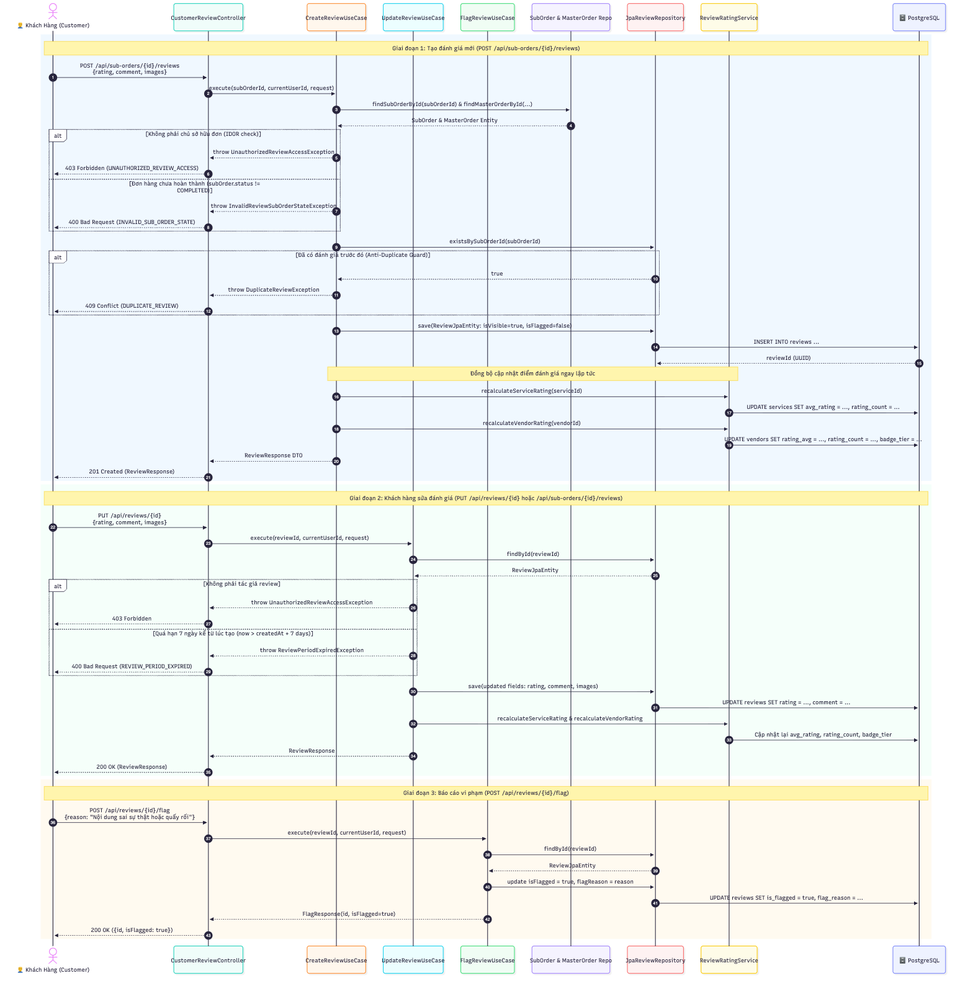
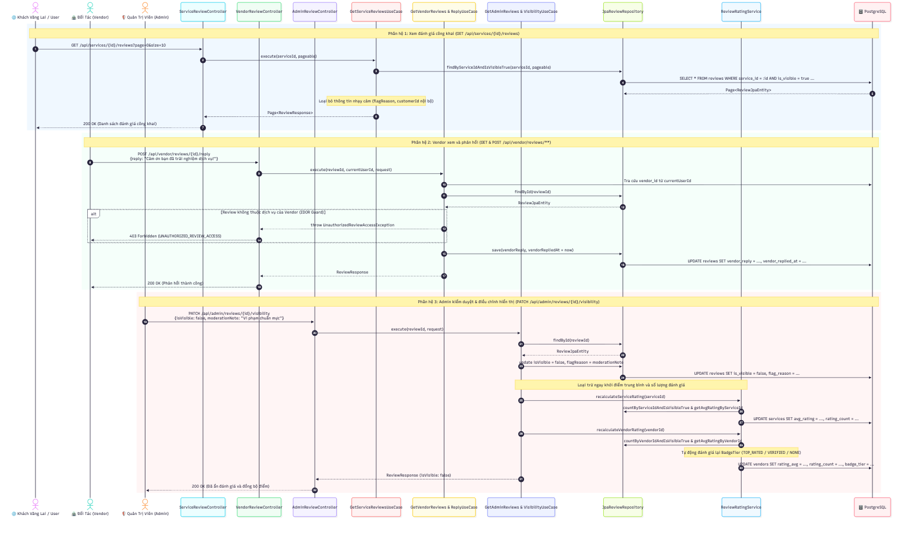
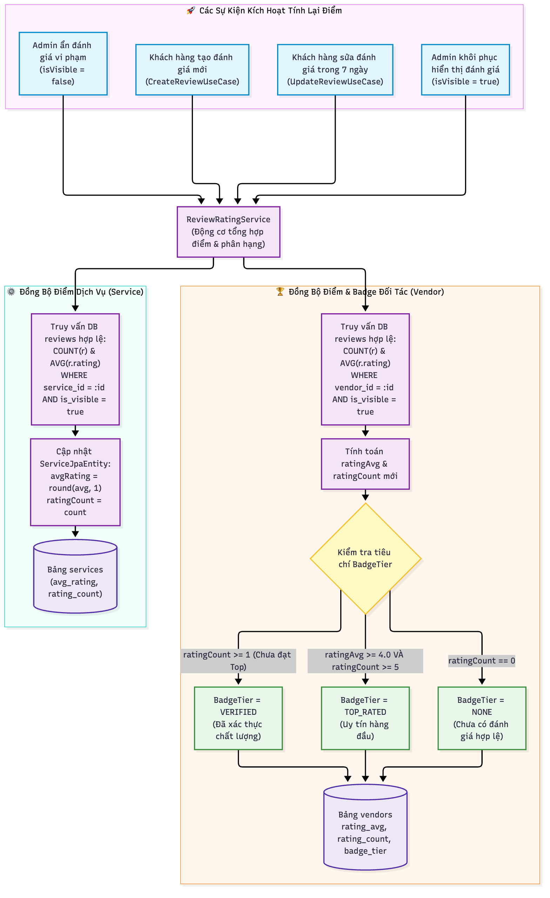

# 📖 TÓM TẮT CÁC SƠ ĐỒ — MODULE REVIEW (HỆ THỐNG ĐÁNH GIÁ & CHẤT LƯỢNG DỊCH VỤ)

> Module Review chịu trách nhiệm quản lý toàn bộ vòng đời ghi và đọc đánh giá của khách hàng sau khi hoàn thành trải nghiệm, hỗ trợ phản hồi từ đối tác cung cấp dịch vụ (Vendor), công cụ kiểm duyệt nội dung của quản trị viên (Admin), tự động tổng hợp điểm đánh giá (`avgRating`, `ratingCount`) và suy luận huy hiệu uy tín (`BadgeTier`) cho Vendor theo thời gian thực.

| # | Sơ đồ | Loại | Nội dung |
|---|-------|------|----------|
| 1 | `Review_CustomerLifecycle` | Sequence Diagram | Vòng đời khách hàng: Kiểm tra quyền sở hữu đơn hàng (IDOR Guard), ràng buộc trạng thái hoàn thành (`COMPLETED`), bảo vệ chống trùng lặp (1 trải nghiệm = 1 đánh giá), chính sách sửa đánh giá trong vòng 7 ngày và báo cáo vi phạm (`Flag`) |
| 2 | `Review_Moderation_And_VendorReply` | Sequence Diagram | Vận hành và kiểm duyệt: Khách vãng lai xem đánh giá công khai (chỉ hiển thị review hợp lệ `isVisible = true`), Vendor xem và gửi phản hồi chính thức (bảo vệ quyền sở hữu dịch vụ), Admin kiểm duyệt và ẩn/hiện đánh giá vi phạm |
| 3 | `Review_RatingCalculation_And_BadgeDerivation` | Flowchart | Động cơ tổng hợp điểm và suy luận huy hiệu: Tự động kích hoạt khi tạo mới, chỉnh sửa hoặc ẩn/hiện đánh giá; chỉ tính toán trên các đánh giá hiển thị; cập nhật tức thì `avgRating`/`ratingCount` cho Service và Vendor; phân hạng huy hiệu `NONE`, `VERIFIED`, `TOP_RATED` |

---

## 1. Review_CustomerLifecycle.png — Vòng Đời Đánh Giá Của Khách Hàng



**Các lớp xử lý chính:**
- Controllers: `CustomerReviewController`
- Use Cases: `CreateReviewUseCase`, `UpdateReviewUseCase`, `FlagReviewUseCase`
- Domain Models & Entities: `Review`, `ReviewJpaEntity`, `SubOrderJpaEntity`, `MasterOrderJpaEntity`
- Repositories: `JpaReviewRepository`, `JpaSubOrderRepository`, `JpaMasterOrderRepository`
- Domain Services: `ReviewRatingService`

**Luồng nghiệp vụ chi tiết:**

### Giai đoạn 1: Tạo mới đánh giá (`POST /api/sub-orders/{id}/reviews`)
1. Khách hàng gửi yêu cầu đánh giá kèm `{rating: 1..5, comment, images: ["url1", "url2"]}`.
2. Hệ thống trích xuất `currentUserId` từ Security Context của người dùng đang đăng nhập.
3. **Bảo vệ quyền sở hữu (IDOR Guard):**
   - Tra cứu `SubOrder` theo `subOrderId` và truy vấn `MasterOrder` tương ứng.
   - Kiểm tra `masterOrder.customerId == currentUserId`. Nếu không khớp, ném ngoại lệ `UnauthorizedReviewAccessException` trả về **HTTP 403 Forbidden**.
4. **Kiểm tra trạng thái trải nghiệm:**
   - Đơn phụ bắt buộc phải ở trạng thái `COMPLETED` (`subOrder.status == COMPLETED`). Nếu chưa hoàn thành (đang `PENDING`, `CONFIRMED`, `CANCELLED`...), ném ngoại lệ `InvalidReviewSubOrderStateException` trả về **HTTP 400 Bad Request**.
5. **Cơ chế chống tạo trùng lặp (Anti-Duplicate Guard):**
   - Kiểm tra ràng buộc duy nhất 1 đánh giá cho mỗi đơn phụ: `existsBySubOrderId(subOrderId)`.
   - Nếu đã tồn tại đánh giá trước đó, ném ngoại lệ `DuplicateReviewException` trả về **HTTP 409 Conflict**.
6. **Lưu trữ đánh giá:**
   - Khởi tạo `ReviewJpaEntity` với `isVisible = true`, `isFlagged = false`, `rating`, `comment` và mảng ảnh đính kèm.
   - Lưu vào cơ sở dữ liệu PostgreSQL.
7. **Đồng bộ điểm số tức thì:**
   - Kích hoạt `ReviewRatingService.recalculateServiceRating(serviceId)` cập nhật điểm dịch vụ.
   - Kích hoạt `ReviewRatingService.recalculateVendorRating(vendorId)` cập nhật điểm và huy hiệu Vendor.
8. Trả về thông tin đánh giá vừa tạo (`201 Created`).

### Giai đoạn 2: Chỉnh sửa đánh giá (`PUT /api/reviews/{id}` hoặc `PUT /api/sub-orders/{id}/reviews`)
1. Khách hàng gửi yêu cầu cập nhật `{rating, comment, images}`.
2. Tra cứu bản ghi `Review` theo `reviewId` (hoặc tra cứu ID thông qua `subOrderId`).
3. **Kiểm tra quyền sở hữu:** Xác minh `review.customerId == currentUserId` (403 Forbidden nếu không phải tác giả).
4. **Chính sách thời hạn chỉnh sửa (7-Day Policy):**
   - Kiểm tra `OffsetDateTime.now() <= review.createdAt.plusDays(7)`.
   - Nếu quá thời hạn 7 ngày kể từ lúc tạo, ném ngoại lệ `ReviewPeriodExpiredException` trả về **HTTP 400 Bad Request**.
5. Cập nhật các trường thông tin thay đổi và lưu vào DB.
6. Tự động tính toán lại điểm trung bình cho Service và Vendor tương ứng.
7. Trả về thông tin đánh giá đã cập nhật (`200 OK`).

### Giai đoạn 3: Báo cáo đánh giá vi phạm (`POST /api/reviews/{id}/flag`)
1. Người dùng gửi lý do báo cáo `{reason}` khi phát hiện đánh giá quấy rối, ngôn từ thù địch hoặc thông tin sai lệch.
2. Hệ thống đánh dấu cờ `review.isFlagged = true`, lưu lại `flagReason = reason`.
3. Trả về xác nhận đã tiếp nhận báo cáo (`{id, isFlagged: true}`).

---

## 2. Review_Moderation_And_VendorReply.png — Vận Hành, Phản Hồi Đối Tác & Kiểm Duyệt Quản Trị



**Các lớp xử lý chính:**
- Controllers: `ServiceReviewController`, `VendorReviewController`, `AdminReviewController`
- Use Cases: `GetServiceReviewsUseCase`, `GetVendorReviewsUseCase`, `ReplyVendorReviewUseCase`, `GetAdminReviewsUseCase`, `UpdateReviewVisibilityUseCase`
- Repositories: `JpaReviewRepository`, `JpaVendorRepository`

**Luồng nghiệp vụ chi tiết:**

### Phân hệ 1: Xem đánh giá công khai (`GET /api/services/{id}/reviews`)
1. Khách vãng lai truy cập xem đánh giá của một tour/dịch vụ (endpoint được cấu hình `permitAll()`).
2. Sử dụng phân trang (`page`, `size`, `sort`).
3. **Nguyên tắc hiển thị an toàn:** Chỉ truy vấn các đánh giá có trạng thái hiển thị hợp lệ:
   ```sql
   SELECT * FROM reviews WHERE service_id = :serviceId AND is_visible = true ORDER BY created_at DESC;
   ```
4. DTO phản hồi `ReviewResponse` loại bỏ hoàn toàn các trường kiểm duyệt nội bộ (`flagReason`, admin notes) để đảm bảo tính riêng tư.

### Phân hệ 2: Đối tác quản lý và phản hồi (`GET & POST /api/vendor/reviews/**`)
1. **Xem danh sách đánh giá của Vendor (`GET /api/vendor/reviews`):**
   - Yêu cầu vai trò `ROLE_VENDOR`.
   - Hệ thống tự động ánh xạ `currentUserId` sang `vendorId` của Vendor đang đăng nhập.
   - Truy vấn danh sách đánh giá thuộc về tất cả các dịch vụ do chính Vendor đó quản lý.
2. **Gửi phản hồi chính thức (`POST /api/vendor/reviews/{id}/reply`):**
   - Vendor gửi nội dung phản hồi `{reply: "..."}`.
   - **IDOR Guard:** Kiểm tra `review.vendorId == currentVendorId`. Nếu đánh giá thuộc về dịch vụ của đối tác khác, ném `UnauthorizedReviewAccessException` (HTTP 403 Forbidden).
   - Cập nhật `vendorReply = reply`, `vendorRepliedAt = OffsetDateTime.now()`.
   - Trả về thông tin đánh giá kèm phản hồi chính thức của Vendor.

### Phân hệ 3: Quản trị viên kiểm duyệt & Ẩn/Hiện đánh giá (`GET & PATCH /api/admin/reviews/**`)
1. **Tra cứu kiểm duyệt toàn hệ thống (`GET /api/admin/reviews`):**
   - Yêu cầu vai trò `ROLE_ADMIN`.
   - Hỗ trợ bộ lọc đa tiêu chí qua `JpaSpecification`: lọc theo `serviceId`, `vendorId`, `isFlagged` (đánh giá bị người dùng báo cáo) và `isVisible` (đánh giá đang hiển thị hoặc đã bị ẩn).
2. **Điều chỉnh trạng thái hiển thị (`PATCH /api/admin/reviews/{id}/visibility`):**
   - Admin gửi yêu cầu `{isVisible: false, moderationNote: "Vi phạm từ ngữ thô tục"}`.
   - Cập nhật `review.isVisible = false` và lưu vết lý do xử lý vào `review.flagReason`.
   - **Đồng bộ loại trừ điểm số:** Ngay khi bị ẩn, đánh giá này lập tức bị loại bỏ khỏi tính toán điểm trung bình và số lượng review của cả Service và Vendor.
   - Nếu Admin chọn khôi phục (`isVisible = true`), hệ thống sẽ tính toán cộng dồn điểm lại như ban đầu.

---

## 3. Review_RatingCalculation_And_BadgeDerivation.png — Động Cơ Tính Điểm & Phân Hạng Huy Hiệu



**Lớp xử lý chính:** `com.danasea.backend.modules.operation.domain.services.ReviewRatingService`

### Cơ chế tính toán thời gian thực:
Bất kỳ khi nào xảy ra 1 trong 4 sự kiện sau, `ReviewRatingService` sẽ được kích hoạt để đồng bộ lại dữ liệu:
1. Có đánh giá mới được tạo thành công.
2. Khách hàng chỉnh sửa số sao (`rating`) của đánh giá hiện có.
3. Quản trị viên ẩn một đánh giá vi phạm (`isVisible = false`).
4. Quản trị viên khôi phục hiển thị một đánh giá (`isVisible = true`).

### Quy tắc tính toán:

1. **Tổng hợp cấp Dịch vụ (`Service`):**
   - Chỉ tính toán trên các bản ghi có `is_visible = true`.
   - `rating_count = COUNT(reviews)`
   - `avg_rating = ROUND(AVG(rating), 1)` (nếu `rating_count == 0` thì `avg_rating = 0.0`).
   - Cập nhật trực tiếp vào bảng `services`.

2. **Tổng hợp cấp Nhà cung cấp (`Vendor`):**
   - Chỉ tính toán trên các bản ghi có `is_visible = true` thuộc tất cả các dịch vụ của Vendor.
   - `rating_count = COUNT(reviews)`
   - `rating_avg = ROUND(AVG(rating), 1)` (nếu `rating_count == 0` thì `rating_avg = 0.0`).

3. **Cây quyết định suy luận Huy hiệu uy tín (`BadgeTier`):**
   - **`TOP_RATED`**: Đạt được khi nhà cung cấp có điểm trung bình xuất sắc và đủ số lượng đánh giá tối thiểu:
     $$\text{ratingAvg} \ge 4.0 \quad \text{VÀ} \quad \text{ratingCount} \ge 5$$
   - **`VERIFIED`**: Đã bắt đầu nhận được đánh giá từ khách hàng thực tế nhưng chưa đạt ngưỡng Top Rated:
     $$\text{ratingCount} \ge 1 \quad (\text{chưa đạt TOP\_RATED})$$
   - **`NONE`**: Khi Vendor chưa có bất kỳ đánh giá hợp lệ nào:
     $$\text{ratingCount} = 0$$
   - Lưu trữ đồng thời `rating_avg`, `rating_count` và `badge_tier` vào bảng `vendors`.

---

## 4. Bảng Tra Cứu Mã Lỗi & HTTP Status

| Mã lỗi (`message_key`) | HTTP Status | Trường hợp kích hoạt |
| :--- | :--- | :--- |
| `error.unauthorized_review_access` | **403 Forbidden** | Khách hàng đánh giá đơn của người khác, hoặc Vendor phản hồi review của dịch vụ khác. |
| `error.invalid_sub_order_state` | **400 Bad Request** | Đơn hàng chưa ở trạng thái `COMPLETED` khi gửi đánh giá. |
| `error.duplicate_review` | **409 Conflict** | Đơn phụ này đã từng được đánh giá (vi phạm ràng buộc 1 trải nghiệm = 1 đánh giá). |
| `error.review_period_expired` | **400 Bad Request** | Khách hàng cố tình chỉnh sửa đánh giá sau thời hạn 7 ngày kể từ lúc tạo. |
| `error.review_not_found` | **404 Not Found** | Không tìm thấy đánh giá với ID được yêu cầu. |
